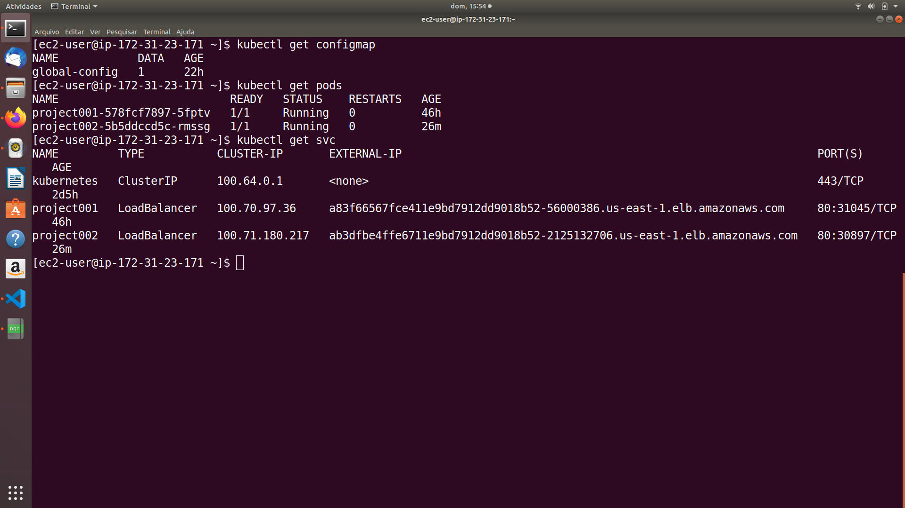
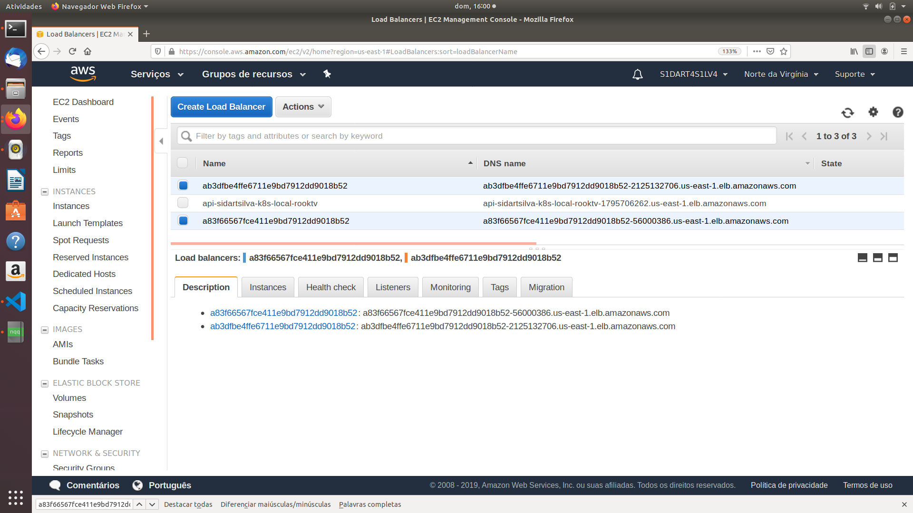
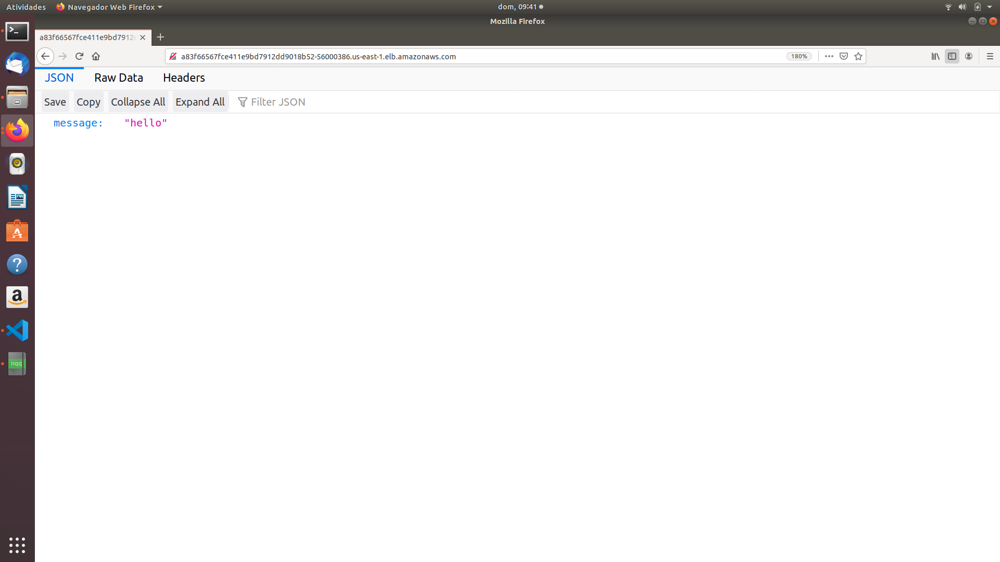
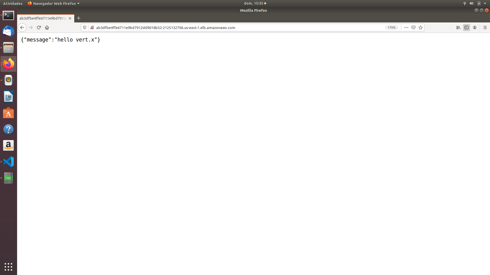

# Project 002 - Consuming HTTP Microservices

One microservice does not form an application; you need a system of microservices. Now that we have our first microservice running, let’s write a second microservice to consume it. This second microservice also provides an HTTP facade to invoke it, and on each invocation calls the microservice we just implemented.

This project is based on the references below.

    ESCOFFIER, C. Building Reactive Microservices in Java Asynchronous and Event-Based Application Design. First Edition. California: O’Reilly Media, Inc., 2017.

    RedHat Developer, accessed 1 November 2019, <https://developers.redhat.com/promotions/building-reactive-microservices-in-java>

    Kubernetes Hands-On - Deploy Microservices to the AWS Cloud 2018, Udemy, accessed 1 November 2019, <https://www.udemy.com/course/kubernetes-microservices>

### Project Creation

    mkdir project002
    cd project002

    mvn io.fabric8:vertx-maven-plugin:1.0.5:setup \
      -DprojectGroupId=io.vertx.sidartasilva.microservice \
      -DprojectArtifactId=project-002 \
      -Dverticle=io.vertx.sidartasilva.http.HelloConsumerMicroservice \
      -Ddependencies=web,web-client,rx

The last command adds another dependency: the Vert.x web client, an asynchronous HTTP client. We will use this client to call the first microservice. The command has also added the Vert.x RxJava binding we are going to use later.

In the start method, we create a WebClient and a Router. On the created router, we register a route on “/” and start the HTTP server, passing the router accept method as requestHandler. The handler of the route is a method reference (invokeMyFirstMicroservice). This method uses the web client to invoke  the first microservice with a specific path (/vert.x) and write the result to the HTTP response.

Once the HTTP request is created, we call send to emit the request. The handler we passed in is invoked when either the response arrives or an error occurs.

The if-else block checks to see whether the invocation has succeeded. Don’t forget that it’s a remote interaction and has many reasons to fail. For instance, the first microservice may not be running. When it succeeds, we write the received payload to the response; otherwise, we reply with a 500 response.
 

    private WebClient client;

    @Override
    public void start() {
        client = WebClient.create(vertx);

        Router router = Router.router(vertx);

        router.get("/").handler(this::invokeMyFirstMicroservice);

        vertx.createHttpServer()
            .requestHandler(router::accept)
            .listen(8081);
    }

    private void invokeMyFirstMicroservice(RoutingContext rc) {
        HttpRequest<JsonObject> request = client
            .get(
                80
                , System.getenv("HOST")
                , "/vert.x")
            .as(BodyCodec.jsonObject());

            request.send(ar -> {
                if (ar.failed()) {
                    rc.fail(ar.cause());
                } else {
                    rc.response().end(ar.result().body().encode());
                }
            });
    }
 
 
### Dockerfile

    FROM openjdk:8-jre-alpine
    ENV VERTICLE_FILE project-002-1.0-SNAPSHOT.jar
    ENV VERTICLE_HOME /usr/verticles
    EXPOSE 8095
    COPY $VERTICLE_FILE $VERTICLE_HOME/
    WORKDIR $VERTICLE_HOME
    ENTRYPOINT ["sh", "-c"]
    CMD ["exec java -jar $VERTICLE_FILE"]

### Applying the Yaml Files

    kubectl apply -f config-project002.yaml

    kubectl apply -f deployment-project002.yaml

    kubectl apply -f service-project002.yaml

## Yaml files

### ConfigMap Yaml File

This is the Yaml file for the ConfigMap named as global-config.

    apiVersion: v1
    kind: ConfigMap
    metadata:
      name: global-config
      namespace: default

    data:
      loadbalancer.host: "a83f66567fce411e9bd7912dd9018b52-56000386.us-east-1.elb.amazonaws.com"

### Deployment Yaml File

This is the Yaml file for the Deployment named as project002.

 
    apiVersion: apps/v1
    kind: Deployment
    metadata:
      name: project002
    spec:
      selector:
        matchLabels:
          app: project002
      replicas: 1
      template:
        metadata:
          labels:
            app: project002
        spec:
          containers:
          - name: project002
            image: sidartasilva/project002:latest
            env:
            - name: HOST
              valueFrom:
                configMapKeyRef:
                  name: global-config
                  key: loadbalancer.host

 
 ### Service Yaml File

This is the YAML file for the Service named as project002.

    apiVersion: v1
    kind: Service
    metadata:
      name: project002

    spec:
      selector:
        app: project002

      ports:
        - name: http
          port: 80
          targetPort 8081
      type: LoadBalancer

### Checking Pods and Services

And now let's check the created ConfigMap, Pods and Services.

    kubectl get configmap

    kubectl get pods

    kubectl get services

We are now able to see in EXTERNAL-IP the DNS name of our 2 Load Balancers: a83f66567fce411e9bd7912dd9018b52-56000386.us-east-1.elb.amazonaws.com and ab3dfbe4ffe6711e9bd7912dd9018b52-2125132706.us-east-1.elb.amazonaws.com.

 ### Load Balancer

These are the AWS Load Balancers created into our cluster.

So we're able to check that our first HTTP Microservice, i.e., the hello Microservice is running by entering the DNS name of our firstly created Load Balancer, which is a83f66567fce411e9bd7912dd9018b52-56000386.us-east-1.elb.amazonaws.com.

And we're able to check that our newest Microservice, i.e., the hello Consumer Microservice is running by entering on the browser the DNS name of the latest Load Balancer that was created, which is ab3dfbe4ffe6711e9bd7912dd9018b52-2125132706.us-east-1.elb.amazonaws.com.

